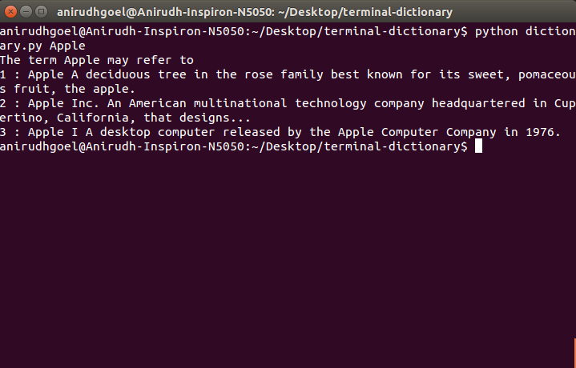

# Terminal Dictionary

Simple script written in Python to get the meaning of any word, with disambiguations, directly in the terminal.

## Instructions to run
+ Clone project
```
git clone https://github.com/AnirudhGoel/terminal-dictionary.git && cd terminal-dictionary
```
+ Install dependencies
```
[sudo] pip install requests
```
+ Run script
```python
  python dictionary.py <your-string>
```

